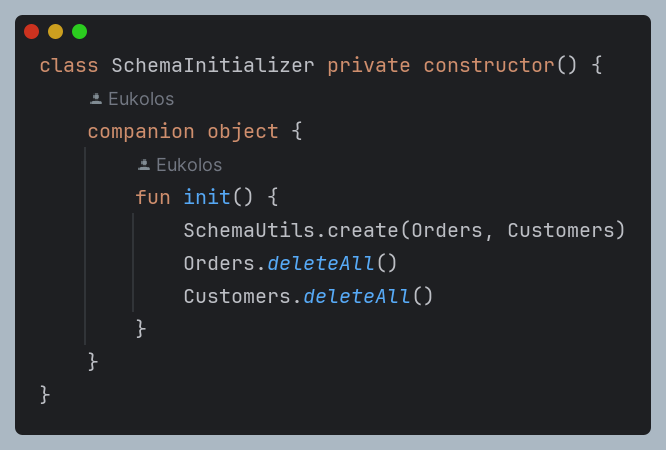
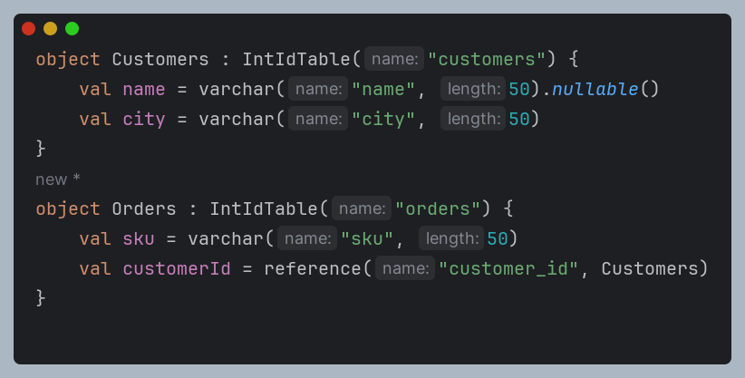
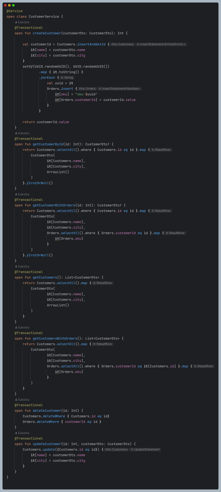
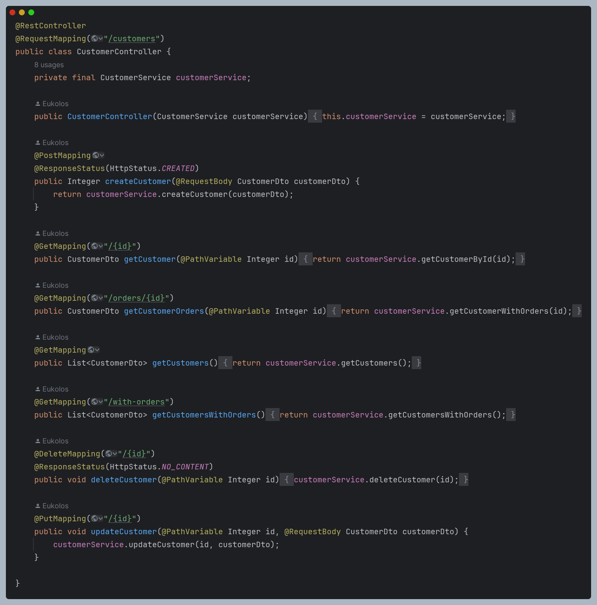

### Kotlin Jetbrains Exposed Orm With Java


### Summary

This project is a simple example of how to use the Jetbrains Exposed ORM with Kotlin and Java. The project is a simple REST API that allows you to create, read, update, and delete customers.

### 🔨 Run the App

#### Maven

<b>1 )</b> Download your project from this link shown below
```
    git clone https://github.com/Eukolos/jetbrains-exposed-orm.git
```

<b>2 )</b> Go to the project's home directory shown below
```
    cd jetbrains-exposed-orm
```

<b>3 )</b> Create native image though this command shown below
```
    mvn -Pnative spring-boot:build-image
```

<b>4 )</b> Run the project though this command shown below
```
    docker-compose up
```

### Used Dependencies
* Java
* Kotlin
* Spring
    * Spring Boot 3
    * Spring Web
    * Spring JDBC
* *Jetbrains Exposed ORM*
* Postgres
* PGAdmin
* Maven
* Docker
* GraalVM CE Java 17-22.3.0


<details>

<summary><strong><span style="font-size: larger;">Codes</span></strong></summary>

### Initialize Models




### Model Layer



### Service Layer



### Controller Layer



</details>


<details>

<summary><strong><span style="font-size: larger;">Endpoints</span></strong></summary>

### Create a Customer

```
POST /customers
Accept: application/json
Content-Type: application/json

{
  "name": "John Doe",
  "city": "New York"
}
RESPONSE: HTTP 201 (Created)
Location header: http://localhost:8080/customers/{id}
```

### Get Customer by ID

```
GET /customers/{id}
Accept: application/json
Content-Type: application/json

{
  "name": "John Doe",
  "city": "New York"
}
RESPONSE: HTTP 200 (OK)
Content: "application/json"
Location header: http://localhost:8080/customers/{id}
```

### Get Customer Orders by ID

```
GET /customers/orders/{id}
Accept: application/json
Content-Type: application/json

{
  "name": "John Doe",
  "city": "New York",
  "orders": ["Order1", "Order2"]
}

RESPONSE: HTTP 200 (OK)
Content: "application/json"
Location header: http://localhost:8080/customers/orders/{id}
```

### Get All Customers

```
GET /customers
Accept: application/json
Content-Type: application/json

[
  {
    "name": "John Doe",
    "city": "New York"
  },
  {
    "name": "Jane Doe",
    "city": "Los Angeles"
  }
]

RESPONSE: HTTP 200 (OK)
Content: "application/json"
Location header: http://localhost:8080/customers
```

### Delete Customer by ID

```
DELETE /customers/{id}
Accept: application/json
Content-Type: application/json

{}
RESPONSE: HTTP 204 (No Content)
Location header: http://localhost:8080/customers/{id}
```

### Update Customer by ID

```
PUT /customers/{id}
Accept: application/json
Content-Type: application/json

{
  "name": "Updated Name",
  "city": "Updated City",
}
RESPONSE: HTTP 200 (OK)
Location header: http://localhost:8080/customers/{id}
```

</details>


### Resource

- [Josh's Video](https://www.youtube.com/watch?v=4p5ovtFTHts)
- [Jetbrains Exposed ORM for Kotlin](https://github.com/JetBrains/Exposed)
- [Example About Exposed Orm from Ktor side](https://ktor.io/docs/interactive-website-add-persistence.html#run_app)
- [Using Java and Kotlin in Same Project](https://www.codecentric.de/wissens-hub/blog/how-to-mix-java-and-kotlin-within-one-spring-boot-application)
- [spring-boot-docker-compose Dependency](https://www.youtube.com/watch?v=lS1GwdIfk0c)
- [Graalvm Native Build](https://www.graalvm.org/22.2/reference-manual/native-image/guides/use-native-image-gradle-plugin/)
- [Issue Solve About Native Build](https://github.com/Jetbrains/Exposed/issues/1274)